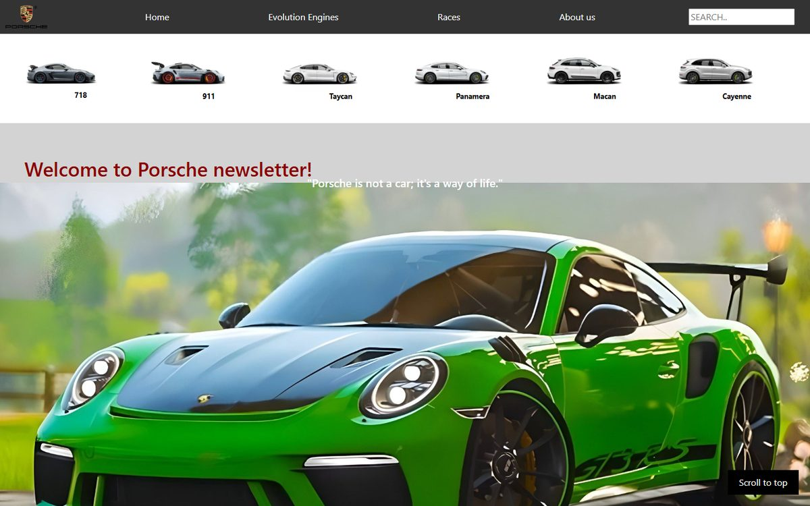
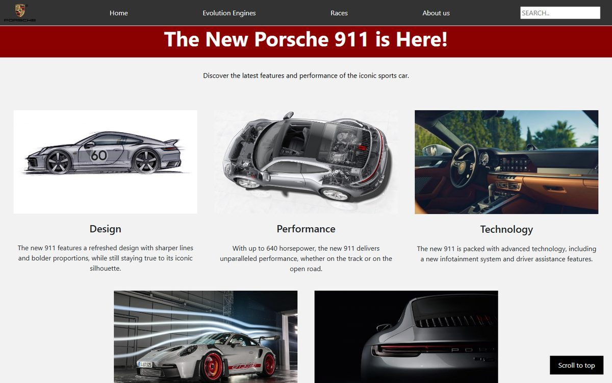
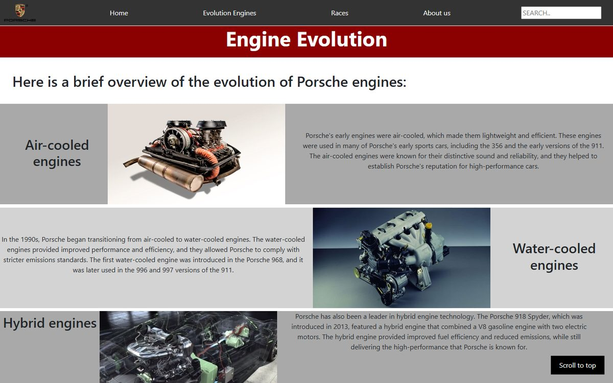
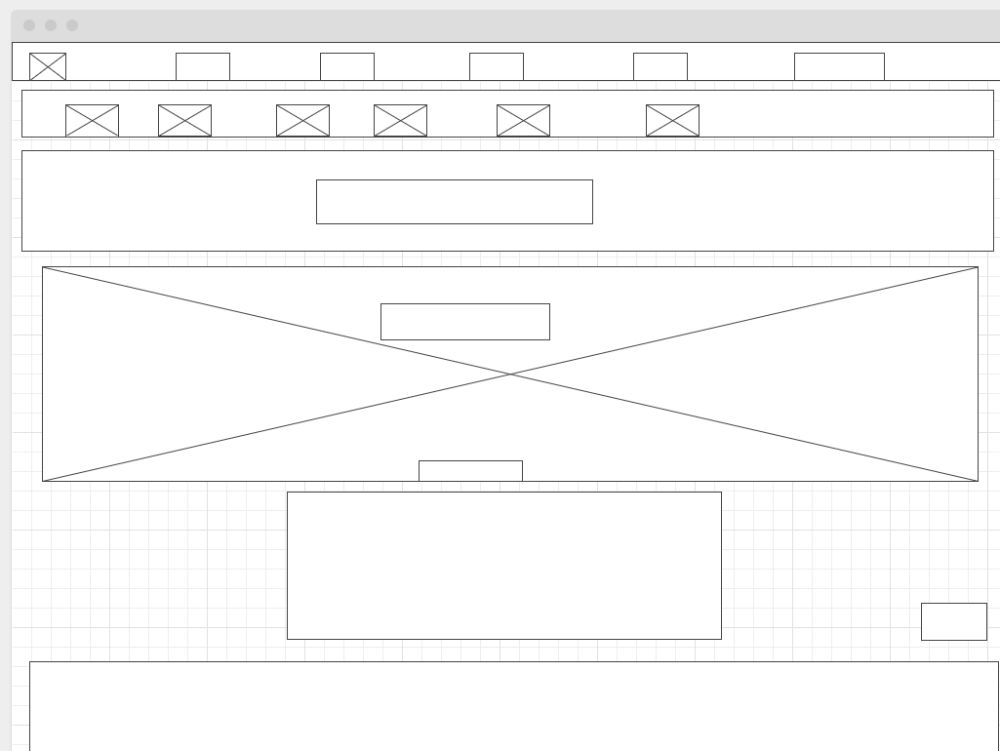

# Porsche Newsletter Website

A six-page website for Porsche enthusiasts covering the model lineup, engine history, racing news and the new 911, built with HTML, CSS, JavaScript and Bootstrap.

**▶ [View live site](https://ziadelh.github.io/porsche-website/)**

> Unofficial fan project, not affiliated with Porsche AG. Images belong to their respective owners.

## Pages

| Page | Content |
|---|---|
| **Home** | Model lineup bar, auto-playing image slideshow with indicator dots, newsletter overview |
| **Engines** | Evolution from air-cooled to water-cooled, hybrid and electric; the Flat-Six, Carrera GT V10 and 917 |
| **Races** | Latest racing news, race schedule table, driver profiles with zoom-on-hover photos |
| **911** | Design, performance, technology, aerodynamics and hybrid option |
| **About Us** | Porsche history, engineering innovations, design evolution, racing legacy |
| **Coming Soon** | Placeholder for upcoming content |

All pages share the navigation bar, a newsletter sign-up form and social links; the content pages also have a smooth scroll-to-top button.

  
  

## Design Process

Each page was wireframed before being built ([all wireframes](docs/wireframes/)):

## Tech Stack

HTML5 · CSS3 · JavaScript · Bootstrap 4 · Font Awesome

## Run

View it [live](https://ziadelh.github.io/porsche-website/), or open `index.html` in any browser. No build step needed.

## Author

Ziad Elhussein
